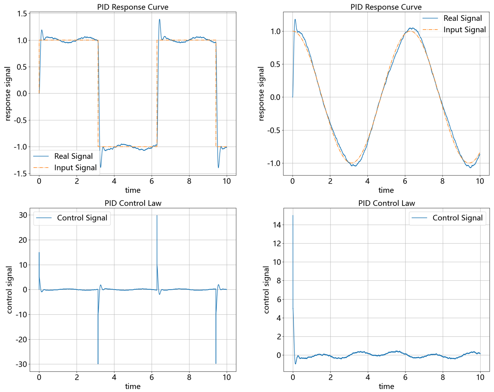
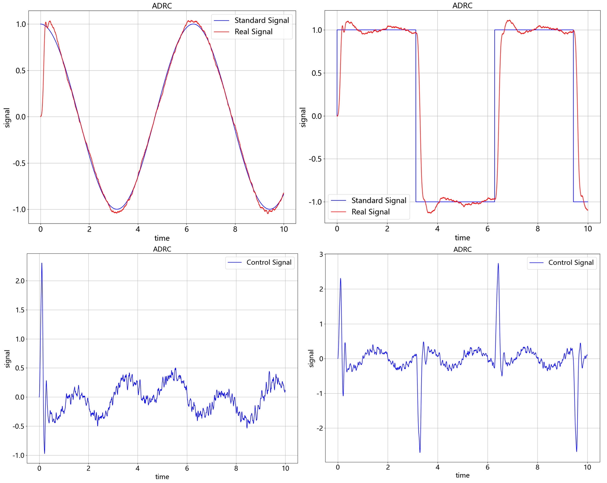
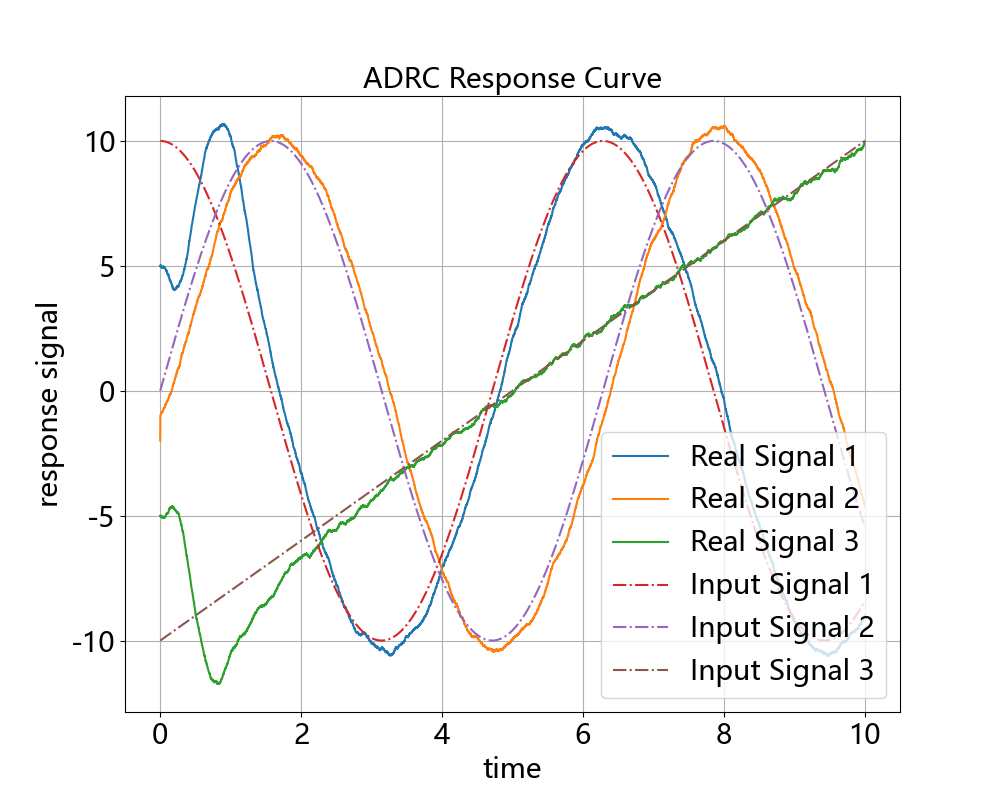
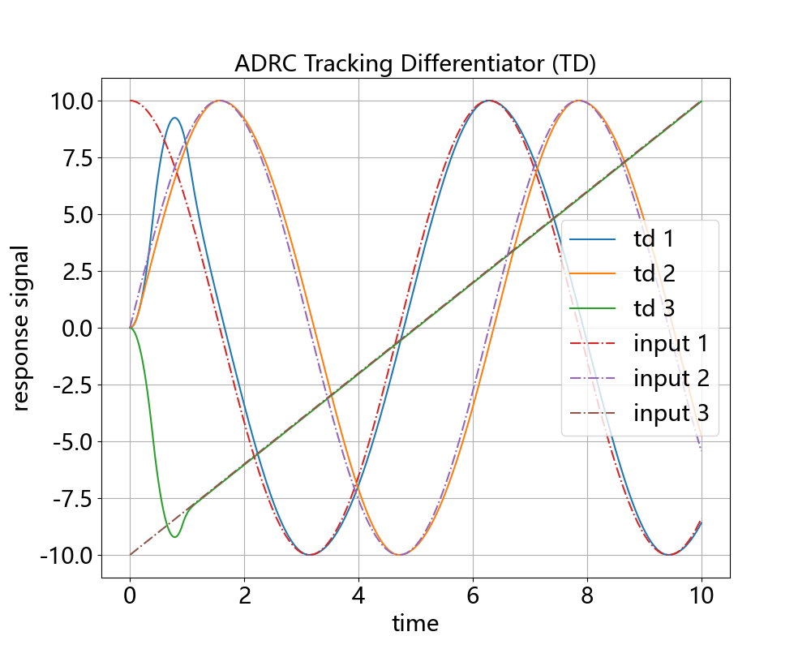
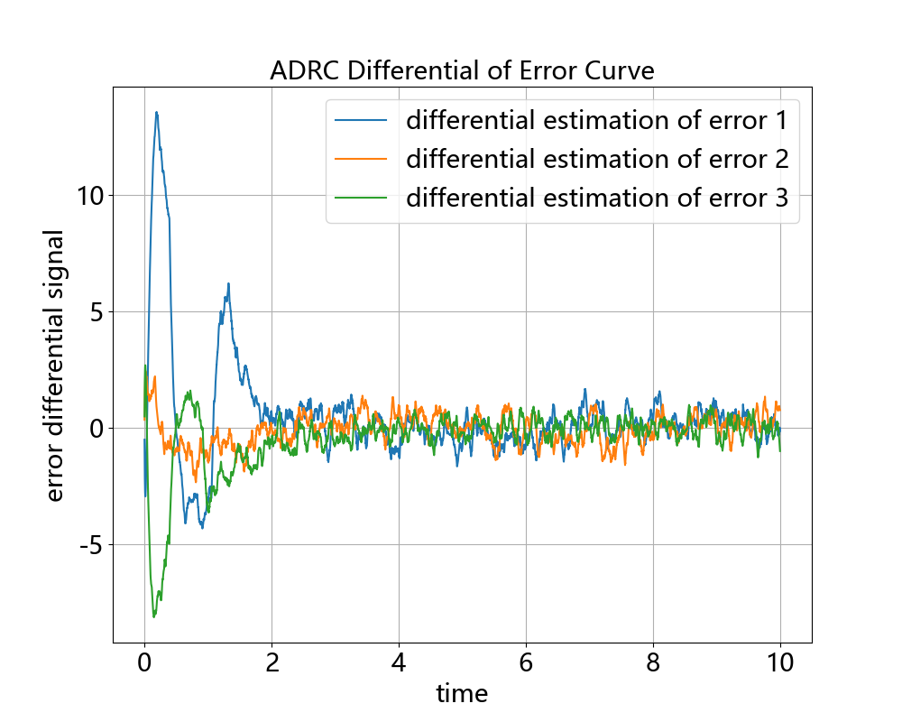
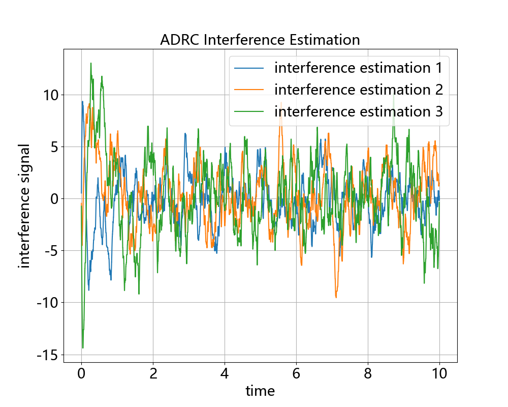

# Control Algorithm

## 一、控制算法:

v表示参考轨迹，y表示实际轨迹（被控对象输出），x表示状态（当无法得到时需设计观测器）。

#### 1.无模型

| 算法名                                               | 类名         | 输入 | 输出 | 备注                        |
| ---------------------------------------------------- | ------------ | ---- | ---- | --------------------------- |
| 位置式PID控制<br />Proportion Integral Differential  | PID          | v、y | u    | 自带抗积分饱和+积分分离功能 |
| 增量式PID控制<br />Increment PID Control             | IncrementPID | v、y | u    | 自带抗积分饱和+积分分离功能 |
| 自抗扰控制<br />Active Disturbance Rejection Control | ADRC         | v、y | u    | 缺点：参数巨多。。。        |

#### 2.基于模型

##### 2.1基于优化

基于模型进行优化控制

| 算法名                                           | 类名 | 输入     | 输出 | 备注                                                              |
| ------------------------------------------------ | ---- | -------- | ---- | ----------------------------------------------------------------- |
| 模型预测控制<br />Model Predictive Control       | MPC  | v_seq、x | u    | 支持非线性系统<br />缺点：计算慢，且需要知道未来n步的v            |
| 线性二次型调节器<br />Linear Quadratic Regulator | LQR  | v_all、y | u    | 支持线性时变系统<br />缺点：强依赖模型，且必须已知v的全部轨迹信息 |

##### 2.2基于学习

模型用来产生训练数据

| 算法名                                          | 类名 | 输入 | 输出 | 备注                                                   |
| ----------------------------------------------- | ---- | ---- | ---- | ------------------------------------------------------ |
| SAC-Auto算法控制<br />Soft Actor Critic Control | SAC  | v、y | u    | 连续控制                                               |
| DQN算法控制<br />Deep Q Network Control        | DQN  | v、y | u    | 离散控制，需将控制量进行编码                           |
| QMIX算法控制<br />QMIX Control                 | QMIX | v、y | u    | 多维离散控制，将每个维度的控制量看成一个强化学习智能体 |

##### 2.3基于搜索

模型用来评估搜索解的好坏

| 算法名                                  | 类名            | 输入     | 输出 | 备注                                                                                      |
| --------------------------------------- | --------------- | -------- | ---- | ----------------------------------------------------------------------------------------- |
| 智能搜索算法控制<br />AI Search Control | PSO等小动物算法 | v_seq、x | u    | 原理类似MPC，直接搜索u_seq，u_seq带入模型评估搜索结果，利用启发算法优化<br />缺点：速度慢 |

#### 3.模糊控制

| 算法名                             | 类名     | 输入 | 输出 | 备注 |
| ---------------------------------- | -------- | ---- | ---- | ---- |
| 模糊PID控制<br />Fuzzy PID Control | FuzzyPID |      |      |      |

## 二、控制器接口:

用于跟踪控制或反馈控制，即y信号（真实状态/观测）跟踪v信号（理想状态/观测），控制器输入v（或v_seq）和y（或x），输出控制量u


##### 1.控制器输入：

| 输入  | 向量情况(ndarray)  | 标量情况(ndarray/float) |
| ----- | ------------------ | ----------------------- |
| v     | shape = (dim, )   | shape = (1, ) / float  |
| v_seq | shape = (n, dim, ) | shape = (n, )           |
| v_all | shape = (t, dim, ) | shape = (t, )           |
| y     | shape = (dim, )    | shape = (1, ) / float  |
| x     | shape = (dim_x, )  | shape = (1, ) / float  |

##### 2.控制器输出：

u为形状为(dim_u, )的向量（一维ndarray），无论v、y是否为标量，输出u都是向量，即使dim_u=1时也不输出float

对于无模型的PID/ADRC控制器：dim==dim_u，对于基于模型的MPC/LQR/AI控制器：dim不一定等于dim_u

##### 3.控制器参数：

超参为(dim, )或(dim_u, )的向量（设置成一维list或ndarray），array长度取决于公式是与v、y相乘的array还是与u相乘的array

超参设置成float时，将自动广播成(dim, )或(dim_u, )的向量

对于MPC/LQR控制器，超参为Qf、Q、R矩阵（设置成二维list或ndarray)

## 三、用法示例:

```python
import numpy as np
from ctrl import PID, PIDConfig
# 设置控制器
dim = 2 # 信号维度
cfg = PIDConfig(dt=0.1, dim=dim, Kp=[5,6], Ki=0.1, Kd=1) # 调参
pid = PID(cfg) # 实例化控制器
# 生成输入信号
t_list = np.arange(0.0, 10.0, dt=cfg.dt)
v_list = np.ones((len(t_list), dim)) # 需要跟踪的信号 v: (dim, )
# 被控对象
def PlantModel(y, u, dt=cfg.dt):
    ...
    return y # y: (dim, ), u: (dim, )
# 仿真
y = np.zeros(2) # 被控信号初值 (dim, )
for v in v_list:
    u = pid(v, y) # 调用控制器
    y = PlantModel(y, u) # 更新被控信号
pid.show() # 绘图输出
```

## 四、参考信号跟踪效果图:

##### 1.PID控制算法：



##### 2.ADRC控制算法：



## 五、无人机轨迹跟踪控制：

##### 1.ADRC跟踪控制











##### **2.MPC非线性模型跟踪控制**

## **六、Requirement**:

python >= 3.9

numpy >= 1.22.3

matplotlib >= 3.5.1

scipy >= 1.7.3

scikit-fuzzy >= 0.4.2

可选：

pytorch >= 1.10.2
