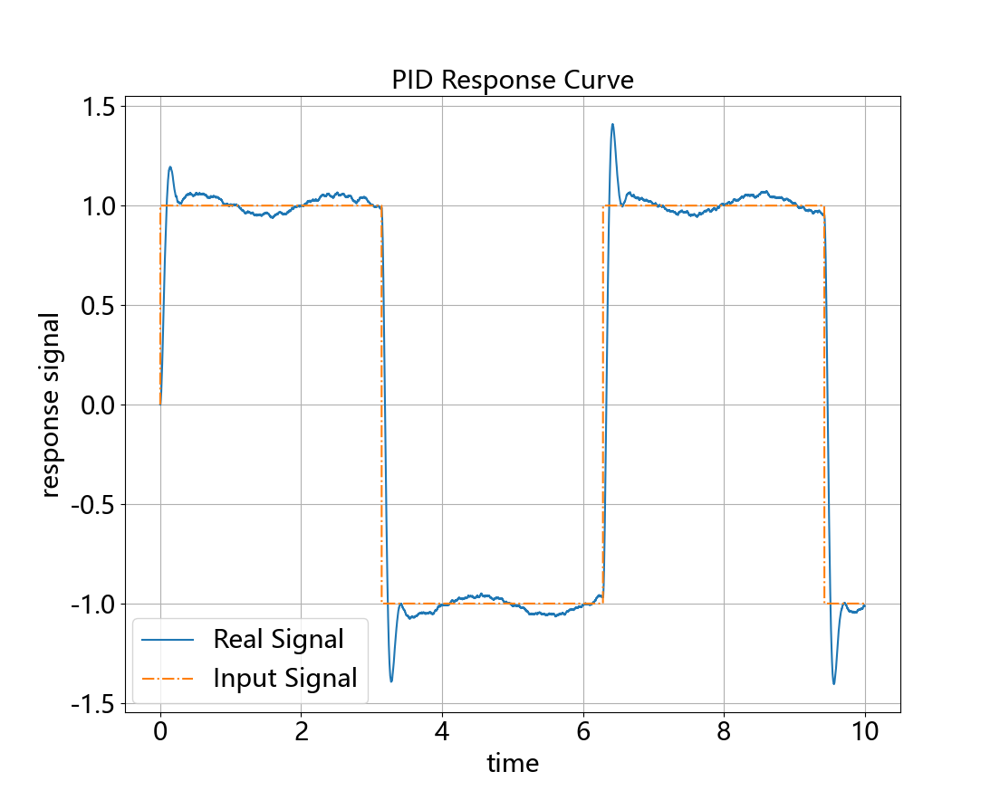

# Control Algorithm

## 控制算法:

| 算法名                                               | 类名         | 性质   | 备注                                                              |
| ---------------------------------------------------- | ------------ | ------ | ----------------------------------------------------------------- |
| 位置式PID控制<br />Proportion Integral Differential  | PID          | 无模型 | 自带抗积分饱和+积分分离功能                                       |
| 增量式PID控制<br />Increment PID Control             | IncrementPID | 无模型 | 自带抗积分饱和+积分分离功能                                       |
| 自抗扰控制<br />Active Disturbance Rejection Control | ADRC         | 无模型 | 缺点：参数巨多。。。                                              |
| 线性二次型调节器<br />Linear Quadratic Regulator     | LQR          | 有模型 | 支持线性时变系统<br />缺点：强依赖模型，且必须已知v的全部轨迹信息 |
| 智能/启发搜索算法控制<br />AI Search Control         | None         | 有模型 | 模型只用来评估搜索结果的好坏                                      |
| 深度强化学习控制<br />DRL Control                    | None         | 有模型 | 模型只用来产生训练数据                                            |

PID跟踪控制yyds，可以考虑AI给PID或ADRC调参，LQR调节器（v=0）用来搞跟踪控制（v!=0）太难了。。。。

## 控制器接口:

用于跟踪控制或反馈控制，即y信号（真实状态/观测）跟踪v信号（理想状态/观测），控制器输入v和y，输出控制量u


###### 控制器输入v、y：

v、y为形状为(dim, )的向量（一维ndarray），或float标量

###### 控制器输出u：

u为形状为(dim_u, )的向量（一维ndarray），无论v、y是否为标量，输出u都是向量，即使dim_u=1时也不输出float

对于PID/ADRC控制器：dim==dim_u，对于LQR/AI控制器：dim不一定等于dim_u

###### 控制器参数：

超参为(dim, )或(dim_u, )的向量（设置成一维list或ndarray），array长度取决于公式是与v、y相乘的array还是与u相乘的array

超参设置成float时，将自动广播成(dim, )或(dim_u, )的向量

对于LQR控制器，超参为Qf、Q、R矩阵（设置成二维list或ndarray)，且要已知v信号轨迹

## 用法示例:

```python
import numpy as np
from PID import PID, PIDConfig
# 设置控制器
dim = 2 # 信号维度
cfg = PIDConfig(dt=0.1, dim=dim, Kp=[5,6], Ki=0.1, Kd=1) # 调参
ctrl = PID(cfg) # 实例化控制器
# 生成输入信号
t_list = np.arange(0.0, 10.0, dt=cfg.dt)
v_list = np.ones((len(t_list), dim)) # 需要跟踪的信号 v: (dim, )
# 被控对象
def PlantModel(y, u, dt=cfg.dt):
    ...
    return y # y: (dim, ), u: (dim, )
# 仿真
y = np.zeros(2) # 被控信号初值 (dim, )
for v in v_list:
    u = ctrl(v, y) # 调用控制器
    y = PlantModel(y, u) # 更新被控信号
ctrl.show() # 绘图输出
```

## 阶跃信号跟踪效果图:



## **Requirement**:

python >= 3.9

numpy >= 1.22.3

matplotlib >= 3.5.1
